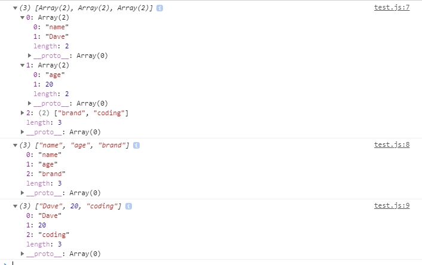

# 2021.01.09 자바스크립트 스터디 발표 자료

### **1. classList**

classList란 자바스크립트로 제어하기 위해 HTML에 정의된 class를 가져오는 속성(Element)이다.

```js
const form = document.querySelector(".js-form"),
  input = form.querySelector("input"),
  gretting = document.querySelector(".js-gretting");

const USER_LS = "currentUser",
  SHOWING_CN = "showing";

function paintGretting(text) {
  form.classList.remove(SHOWING_CN);
  gretting.classList.add(SHOWING_CN);
  gretting.innerText = `Hello ${text}`;
}
```

위의 코드처럼 classList로 받아온 class 값에서 추가하거나 제거하는 .remove, .add로 활용이 가능하다.

### **2. localStorage**

웹 스토리지(web storage)에는 로컬 스토리지(localStorage)와 세션 스토리지(sessionStorage)가 있다.
세션 스토리지는 웹페이지의 세션이 끝날 때 저장된 데이터가 지워지는 반면, 로컬 스토리지는 웹페이지의 세션이 끝나더라도 데이터가 지워지지 않는다.

예를들어 브라우저에 같은 웹 사이트를 여러 탭이나 창에 띄우면, 여러 개의 세션 스토리지에 데이터가 서로 격리되어 저장되며, 각 탭이나 창이 닫힐 때 저장해 둔 데이터도 함께 소멸한다. 반면에, 로컬 스토리지의 경우 여러 탭이나 창 간에 데이터가 서로 공유되며 탭이나 창을 닫아도 데이터는 브라우저에 그대로 남아 있다.

하지만 로컬 스토리지도 동일한 컴퓨터와 동일한 브라우저를 사용할 때만 데이터가 보존이 가능하다.

```js
// 키에 데이터 쓰기
localStorage.setItem("key", value);

// 키로 부터 데이터 읽기
localStorage.getItem("key");

// 키의 데이터 삭제
localStorage.removeItem("key");

// 모든 키의 데이터 삭제
localStorage.clear();

// 저장된 키/값 쌍의 개수
localStorage.length;
```

```js
function saveName(text) {
  localStorage.setItem(USER_LS, text);
}

function handleSubmit() {
  event.preventDefault();
  const currentValue = input.value;
  paintGretting(currentValue);
  saveName(currentValue);
}

function askForName() {
  form.classList.add(SHOWING_CN);
  form.addEventListener("submit", handleSubmit);
}

function paintGretting(text) {
  form.classList.remove(SHOWING_CN);
  gretting.classList.add(SHOWING_CN);
  gretting.innerText = `Hello ${text}`;
}

function loadName() {
  const currentUser = localStorage.getItem(USER_LS);
  if (currentUser === null) {
    askForName();
  } else {
    paintGretting(currentUser);
  }
}
```

### **3. JS와 CSS 사이의 class 이름 활용법**

```html
<form class="js-form form">
  <input type="text" placeholder="What is your name" />
</form>
<h4 class="js-gretting gretting"></h4>
```

```css
.form,
.gretting {
  display: none;
}
```

위의 코드처럼 같은 html 태그안에 자바스크립트에서 사용할 클래스와 css에서 사용할 클래스 변수를 다르게 설정하여 코드의 혼란을 방지하는 부분.

### **4. JSON**

JSON은 JavaScript Object Nation으로 JavaScript 객체 문법으로 구조화된 데이터를 표현하기 위한 문자 기반의 표준 포맷이다.

localStorage를 이용해 데이터를 저장하고 불러오지만 localStoraged에 저장할 경우 자바스크립트 데이터 형식으로 저장을 할 수 없고 String으로 저장이 된다. 그러므로 localStorage에서 데이터를 불러오면 string으로 받을 수 밖에 없다. 그러므로 JSON을 이용해서 자바스크립트 데이터 형식으로 저장하고 불러올 때 자바스크립트 데이터 형식으로 불러올 수 있다.

```js
function saveToDo() {
    localStorage.setItem(TODO_LS, JSON.stringify(toDo));
    // 변수 toDO는 데이터 형이 배열(array)이다.
}

    if (loadedToDo !== null) {
        const parsedToDo = JSON.parse(loadedToDo);
        parsedToDo.forEach(function(toDo) {
            paintToDo(toDo.text);
        });
```

- JSON.stringfy()를 이용해서 string이 아닌 배열 데이터 형으로 저장을 한다.
- JSON.parse()를 이용해 localStorage에서 불러올 데이터를 자바스크립트 데이터 형으로 변환한다.

### **5. fetch()-then**

JavaScript가 많이 강력해지면서 예전처럼 서버 단에서 대신 API를 호출하기 보다는 클라이언트 단에서 직접 API를 호출하는 경우가 많아지고 있다.

원격 API 호출하면 제일 먼저 떠오는 것은 jQuery와 같은 라이브러리이다. 브라우저에서 fetch() 함수를 지원하기 이전에는 클라이언트 단에서 직접 HTTP를 요청하고 응답을 받는게 상당히 복잡해서 이러한 라이브러리를 사용하는 것이 합리적이었지만 라이브러리 도움없이 브라우저에 내장된 fetch() 함수를 이용하는 것이 효율적이다.

### **fetch() 사용법**

fetch() 함수는 첫번째 인자로 URL, 두 번째 인자로 옵션 객체를 받고, 반환된 객체는 API 호출이 성공했을 경우에는 응답(response) 객체를 resolve하고, 실패했을 경우 예외(error) 객체를 reject한다.

```js
function getWeather(lat, lng) {
  fetch(
    `https://api.openweathermap.org/data/2.5/weather?lat=${lat}&lon=${lng}&appid=${API_KEY}&units=metric`
  )
    .then(function (response) {
      return response.json();
    })
    .then(function (json) {
      const temperature = json.main.temp;
      const place = json.name;
      weather.innerText = `${temperature} @ ${place}`;
    });
}
```

위의 코드에서 fetch() 함수로 GET 방식으로 API를 호출한 뒤 then 함수로 받아온 응답 객체를 json으로 리턴 후 다시 then 함수를 이용해 HTML로 표시하는 것을 볼 수 있다.

### **6. Array.from()**


위의 이미지처럼 배열과 비슷한 형태를 갖추고 있지만 배열이 아닌 것을 유사배열이라고 한다.

이러한 유사배열은 배열 메소드, forEach()를 사용하지 못하기 때문에 Array.from() 메소드를 이용해 array로 반환 후 원하는 메소드를 사용할 수 있다.

```js
const color = document.getElementsByClassName("jsColor");

Array.from(color).forEach((colors) =>
  colors.addEventListener("click", handleColorClick)
);
```

### **7. Arrow function**

ES6 문법으로 함수 선언을 보다 간단하게 하기 위해 고안된 문법이다.

Arrow function은 익명 함수이므로 변수에 대입하는 경우가 많다.

- 예1 : 다음 두 함수 선언은 동일한 선언임

```js
let f1 = function () {
  return "Hello World";
};

let f1 = () => "Hello World";
```

- 다음과 같은 세가지 단축 문법 지원

  - function 키워드 생략 가능
  - 함수 인자가 하나뿐이면, 괄호() 생략 가능
  - 함수 코드가 한 라인이라면, 코드 블록 기호(중괄호) 및 return 키워드 생략 가능

- 예2 : 다음 두 함수 선언은 동일한 선언임

```js
let f2 = function (age) {
  return age * 2;
};

let f2 = (age) => age * 2;
```

- 예3 : 다음 두 함수 선언은 동일한 선언임

```js
let f3 = function (item1, item2) {
  return item1 * item2;
};

let f3 = (item1, item2) => item1 * item2;
```

### **8. Class**

ES6 문법으로 Class를 이용해 객체를 생성 할 수 있다.

**Constructor() : 클래스 생성자 함수**

- 클래스 내부에 constructor()라는 이름으로 하나의 생성자 함수를 작성할 수 있음(function 이라는 키워드를 사용하지 않는다.)

- class로 정의된 클래스는 new 클래스명() 으로 객체로 생성될 수 있음
- 클래스 프로퍼티는 constructor 내부에서 this 키워드로 선언될 수도 있음

아래의 예시 처럼 constructor 내부에서 this 키워드를 이용해 변수를 초기화 할 수 있다.

```js
class User1 {
  constructor() {
    this.name = "Dave";
  }
}

const dave = new User1();

class User2 {
  constructor(name) {
    this.name = name;
  }
}

const khan = new User2("Khan");
```

- 클래스 내부에 메서드 선언 또한 가능하다.

```js
class User1 {
  constructor(name) {
    this.name = name;
  }
  get_message() {
    return 'Hello';
  }
}

const dave = new User1('Dave');
console.log(dave.get_message())'

```

- 상속도 일반적인 객체 지향 문법과 유사함
  - extends 를 사용해서, 상속할 클래스를 선언할 수 있음
  - 자식 클래스에서는 super() (부모클래스의 constructor()를 호출함) 를 constructor() 안에서 호출 해야 함
  - 객체지향의 다형성인 메소드 오버라이딩 (자식 클래스에서 해당 메소드를 덮어씌어 다른 동작을 할 수 있는 기능)

```js
class Animal {
  constructor(name) {
    this.name = name;
  }

  get_message() {
    return 'Hello';
  }
}

class User extends Animal {
  constructor(name, brand) {
    super(name);
    this.brand = brand;
  }

  get_message() {
    return 'Hello I am Dave;
  }
}

const dave = new User('Dave', 'coding');
console.log(dave.name, dave.brand);
console.log(dave.get_message());

```

### **9. for-of, Object.entries, Object.keys, Object.values, for-in**

for-of 문

```js
const date = ["Dave", "Alex", "David"];
for (let item of data) {
  // for 반복시 가져올 아이템을 넣을 변수 of 배열변수
  console.log(item);
}
```

- Object.entries : 프로퍼티 키와 값으로 이루어진 각 프로퍼티 셋의 리스트 즉 [[키, 값], [키, 값]] 등으로 이루어진 배열 반환
- Object.keys : 프로퍼티 키 리스트, 즉 [키, 키, 키] 등으로 이루어진 배열 반환
- Object.values : 프로퍼티 값 리스트, 즉 [값, 값, 값] 등으로이루어진 배열 반환

```js
const data = {
  name: "Dave",
  age: 20,
  brand: "coding",
};

console.log(Object.entries(data));
console.log(Object.keys(data));
console.log(Object.values(data));
```



- for-in 은 for-of 와 비슷한 로직으로 객체에서 사용한다.

```js
const data = {
  name: "Dave",
  age: 20,
  brand: "coding",
};

for (let key in data) {
  // 객체의 키를 반복할 때마다 반환
  console.log(key);
}

for (let key in data) {
  // 객체의 키를 반복할 때마다 반환
  console.log(data[key]);
}
```

### **10. forEach, map, filter**

**forEach**

- for 문을 대체해서, 간단히 배열의 각 아이템을 가져올 수 있는 함수

```js
let myArray = [1, 2, "Dava", 100];

myArray.forEach((item) => console.log(item));
```

**map**

- 배열의 각 아이템에 정의한 함수를 적용해서, 새로운 배열을 리턴하는 함수

```js
const myArray1 = [1, 2, 5, 10];
const myArray2 = myArray1.map((item) => item * 2);

console.log(myArray2);
// 결과 값으로 myArray2 = [2, 4, 10, 20] 으로 나온다.
```

**filter**

- 배열에서 특정 조건에 맞는 아이템만 추출할 때 사용하는 기능

```js
let myArray = [1, 2, 3, 4, 5, 6, 7, 8, 9, 10];
let even = myArray.filter((item) => item % 2 === 0);

console.log(even);
```

> ### 참고한 자료
>
> > https://www.daleseo.com/js-web-storage/ https://developer.mozilla.org/ko/docs/Web/API/Element/classList https://developer.mozilla.org/ko/docs/Learn/JavaScript/Objects/JSON https://www.daleseo.com/js-window-fetch/ https://medium.com/@bgh3470/javascript-es6-array-of-array-form-99268eb82a2b
