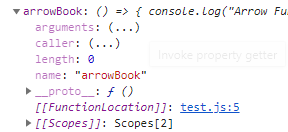

# 2021.01.21 자바스크립트 스터디 발표 자료

<br>

### **1. Arrow Function 특징**

일반함수와 Arrow Function을 비교하여 특징을 살펴보면 아래의 코드처럼 선언할 수 있다.

```js
const book = function () {
  console.log("function");
};

const arrowBook = () => {
  console.log("Arrow Function");
};
```

<br>

위의 코드를 크롬 개발자 도구를 이용해서 디버깅을 해보면 (좌측 이미지: 일반 함수, 우측 이미지: Arrow Function)

 

위의 이미지에서 볼 수 있듯이 일반함수에서는 prototype과 constructor 가 있다. 하지만 화살표 함수(Arrow Funtion)에는 prototype과 constructor가 없다.

즉 화살표 함수는 prototype에 메소드를 연결하여 확장을 할 수 없고, new 연산자로 인스턴스를 생성할 수 없다는 것이다. 또한 추가로 arguement 사용 불가능하다.

이러한 특징을 가지고 있는 화살표 함수는 여러 기능이 없기 때문에 일반 함수보다 가벼워 빠르다는 장점을 가지고 있다는 것을 알 수 있다.

<br>

### **2. 이터레이션**

- 이터레이션(Iteration)의 사전적 의미 : 반복

  - for() 문의 반복 개념과 차이가 있음

- 이터레이션을 위한 프로토콜(protocal) 필요

  - 데이터 송수신 프로토콜 정의

- 즉, 이터레이션은 프로토콜을 갖고 있으며
  - 프로토콜에 따라 이터레이션 수행

<br>

**이터레이션 프로토콜**

- 이터레이션 프로토콜은 오브젝트가 이터레이션 할 수 있는 구조이어야 한다

  - [10, 20]은 가능, 100은 불가능 -> 즉 반복할 수 있는 구조이어야 한다.

- 이터레이션 함수를 갖고 있어야 한다.

- 이터레이션 프로토콜 구분

  - 이터러블(iterable) 프로토콜
  - 이터레이터(iterator) 프로토콜

- 개발자 코드로 프로토콜을 맞추면 이터레이션 할 수 없는 오브젝트를 이터레이션 할 수 있도록 만들 수 있음

<br>

**이터러블 프로토콜**

- 이터러블 프로토콜이란?
  - 오브젝트가 반복할 수 있는 구조이어야 하며 Symol.iterator를 갖고 있어야 한다.

```js
const list = [10, 20];
console.log(list[Sybol.iterator]);
```

- 아래의 오브젝트는 디폴트로 이터러블 프로토콜을 갖고 있다
  - 즉, Symbol.iterator를 갖고 있다
  - Array, Argument, String, TypedArray, Map, Set, DOM NodeList

<br>

**이터러블 오브젝트**

- 이터러블 오브젝트

  - 이터러블 프로토콜을 갖고 있는 오브젝트
  - 반복 구조, Symbol.iterator()

- 자체 오브젝트에는 없지만 이터러블 오브젝트를 상속받아도 된다.
  - 즉, prototype chain(**proto**)에 있으면 된다.
  - 예를 들어, Array 오브젝트를 상속받으면 이터러블 오브젝트가 된다.

<br>

**이터레이터 프로토콜**

- 이터레이터 프로토콜
  값을 순서대로 생성하는 방법

- 이터레이터 오브젝트
  - Symbol.iterator()를 호출하면 이터레이터 오브젝트를 생성하여 반환
  - 이터레이터 오브젝트에 next()가 있다
  - 생성한 오브젝트를 이터레이터라고도 부른다.

```js
const list = [10, 20];
const obj = list[Symbol.iterator]();

console.log(obj.next());
console.log(obj.next());
console.log(obj.next());
```

위의 이터레이터 오브젝트 코드를 실행해보면 아래의 결과처럼 나온다.


결과에서 value는 [10,20]에서 첫 번째 값이고, done: false는 이터레이터 상태이다. 마지막 결과를 보면 undefined는 처리할 값이 없다는 것을 뜻하며 done: true는 이터레이터의 종료를 뜻한다.

<br>

### **3. Array-like**

- Object 타입이지만

  - 배열처럼 이터러블 가능한 오브젝트
  - for() 문으로 전개할 수 있다

- 작성 방법
  - 프로퍼티 key 값을 0부터 1씩 증가하면서 프로퍼티 값을 작성한 뒤
  - length에 전체 프로퍼티 수를 작성해야 한다.

```js
const values = { 0: "가", 1: "나", 2: "다", lenght: 3 };

for (let k = 0; k < values.length; k++) {
  console.log(values[k]);
}
```

<br>

### **4. NPM**

NPM(Node Package Manager)는 명령어로 자바스크립트 라이브러리를 설치하고 관리할 수 있는 패키지 매니저이다.

전 세계 자바스크립트 개발자들이 모두 자바스크립트 라이브러리를 공개된 저장소에 올려놓고 npm 명령어로 편하게 다운로드 받을 수 있으며, npm은 Node.js를 설치시에 같이 설치된다.

<br>

**NPM의 장점**

일반적으로 웹 개발시 JQuery를 이용한다면 필요한 html 태그 밑의 script 태그에 cdn 선언으로 이용을 하는 것을 볼 수 있다.

이런 경우 코드 양이 점점 증가하면 각 라이브러리 간의 버전 의존성을 위해 수정이 필요할 때 수정의 어려움이 발생할 수 있지만 NPM을 이용하면 쉽게 버전관리 등이 가능하고 터미널을 이용해 명령어만 사용하면 쉽게 라이브러리를 설치하고 사용할 수 있다.

아래의 이미지는 버전을 확인할 수 있는 npm 화면이다.


<br>

### **5. 웹팩(WebPack)**

웹팩이란 최신 프론트엔드 프레임워크에서 가장 많이 사용되는 모듈 번들러(Module Bundler)이다. 모듈 번들러란 웹 애플리케이션을 구성하는 자원(HTML, CSS, Javascript, Images 등)을 모두 각각의 모듈로 보고 이를 조합해서 병합된 하나의 결과물을 만드는 도구를 의미한다.

<br>

**모듈 번들링**

아래 그림과 같이 웹 애플리케이션을 구성하는 몇십, 몇백개의 자원들을 하나의 파일로 병합 및 압축 해주는 동작을 모듈 번들링이라 한다.

(빌드, 번들링, 변환 이 세 단어 모두 같은 의미)


<br>

### **6. ES6 Import & Export**

Import와 Export는 자바스크립트의 코드를 모듈화 할 수 있는 기능이다. 여기서 모듈화란 쉽게 말해서 다른 파일에 있는 자바스크립트의 기능을 특정 파일에서 사용할 수 있는 것을 의미한다.

```js
export 변수, 함수

다른 파일에서 가져다 쓸 변수나 함수의 앞에 export 라는 키워드를 붙이고, export된 파일은 import로 불러와 사용할 수 있다.

import { 불러올 변수 또는 함수 이름 } from '파일 경로';

export된 변수나 함수를 {}에 선언한 뒤 해당 파일이 있는 경로를 적어준다.

//math.js

export var pi = 3.14;

//app.js

import { pi } from './math.js';

console.log(pi); // 3.14

```

<br>

## 참고

> > https://joshua1988.github.io/webpack-guide/tutorials/code-splitting.html#%EC%8B%A4%EC%8A%B5-%EC%A0%88%EC%B0%A8 https://joshua1988.github.io/es6-online-book/modules.html#import-export-%EA%B8%B0%EB%B3%B8-%EC%98%88%EC%A0%9C
